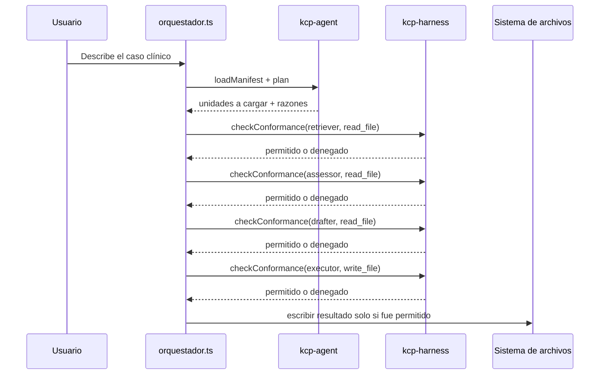
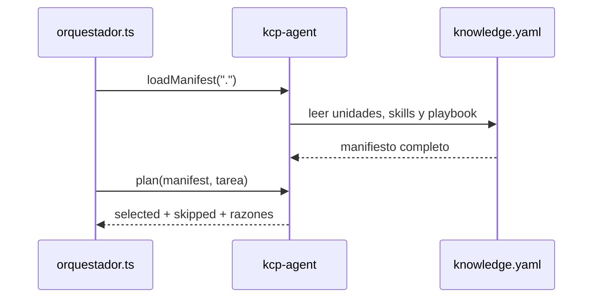
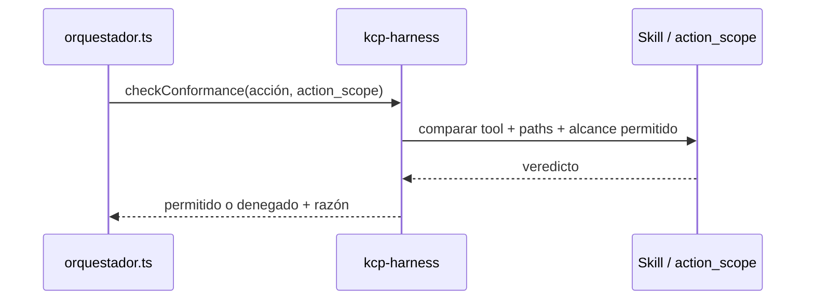
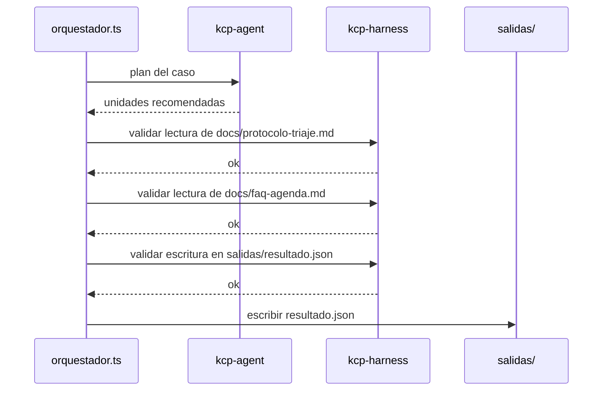
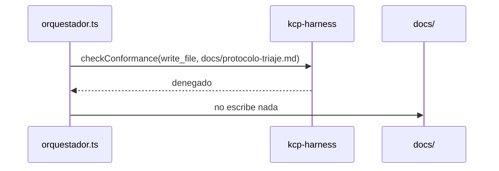

# equipo-agentes-con-kcp

Demo de triaje de citas clínicas gobernada con las herramientas oficiales de KCP:

- `kcp-agent` decide qué conocimiento cargar.
- `kcp-harness` decide qué acciones puede ejecutar cada agente.

La idea es mostrar el mismo caso de negocio de `equipo-agentes`, pero con
componentes reales del ecosistema KCP en vez de lógica casera.

## Qué demuestra esta demo

1. `kcp-agent` lee `knowledge.yaml` y arma un plan determinista.
2. El orquestador ejecuta los pasos del equipo de agentes.
3. `kcp-harness` valida cada acción contra el `action_scope` de cada skill.
4. Si una acción se sale del alcance, se bloquea.
5. Si todo está permitido, el resultado se escribe solo en `salidas/`.

## Roles de cada pieza

| Componente | Qué hace |
|---|---|
| `kcp-agent` | Decide qué unidades del manifiesto usar para el caso. |
| `kcp-harness` | Revisa si cada lectura/escritura respeta el alcance autorizado. |
| `orquestador.ts` | Une ambos pasos y simula el equipo completo. |

## Flujo general



## Secuencia 1: planificación con `kcp-agent`

`kcp-agent` no ejecuta acciones. Solo decide qué conocimiento hace falta.



En esta demo, `kcp-agent`:

- carga el manifiesto,
- decide qué skills y playbook aplican,
- explica por qué unas unidades entran y otras no.

## Secuencia 2: gobernanza de acciones con `kcp-harness`

`kcp-harness` no planifica. Solo verifica si una acción concreta está dentro
del permiso del skill.



En esta demo:

- `retriever`, `assessor` y `drafter` usan `read_file`;
- `executor` usa `write_file`;
- si `executor` intenta escribir fuera de `salidas/`, `kcp-harness` lo bloquea.

## Secuencia 3: ejecución normal



## Secuencia 4: intento fuera de alcance



## Estructura del proyecto

```text
knowledge.yaml   -> manifiesto KCP
harness.yaml     -> reglas runtime para kcp-harness
orquestador.ts   -> demo que conecta kcp-agent + kcp-harness
docs/            -> conocimiento del caso
skills/          -> roles del equipo
salidas/         -> única zona donde escribe executor-skill
```

## Cómo probar la demo

```bash
npm install
npm run validate
npm run harness:check
npm run orquestar
npm run orquestar:romper-alcance
npm test
```

### Casos que cubre la demo

| Caso | Qué pasa |
|---|---|
| Planificación | `kcp-agent` carga el manifiesto y decide qué unidades usar. |
| Lectura válida | `retriever`, `assessor` y `drafter` leen documentos permitidos. |
| Escritura válida | `executor` escribe en `salidas/resultado.json`. |
| Escritura fuera de alcance | `executor` intenta escribir en `docs/` y `kcp-harness` lo bloquea. |
| Relevancia de unidades | `kcp-agent` puede cargar o saltar unidades según la tarea. |

### Qué ver en cada corrida

#### `npm run orquestar`

Escenario normal:

1. `kcp-agent` arma el plan.
2. Esa corrida usa un solo caso clínico. Si no le pasas argumentos, el default es `"fiebre leve y dolor de garganta"`.
3. Las "unidades cargadas" no son otros casos: son skills o documentos que `kcp-agent` consideró relevantes para ese mismo caso.
4. Una unidad puede aparecer como "saltada" por baja relevancia y aun así participar en la demo si el orquestador la simula después para mostrar el control de `kcp-harness`.
5. El orquestador simula los cuatro agentes.
6. `kcp-harness` valida cada acción.
7. El `executor` sí puede escribir en `salidas/`.

Puedes probar otros casos así:

```bash
npx tsx orquestador.ts "dolor de pecho y dificultad para respirar"
npx tsx orquestador.ts "tos persistente y fiebre alta"
```

#### `npm run orquestar:romper-alcance`

Escenario de bloqueo:

1. `kcp-agent` arma el mismo plan base.
2. El `executor` intenta escribir en `docs/`.
3. `kcp-harness` lo rechaza.
4. No se escribe salida.

#### `npm run validate`

Valida que `knowledge.yaml` tenga forma correcta y que el manifiesto se pueda leer.

#### `npm run harness:check`

Valida que `harness.yaml` tenga reglas coherentes para gobernanza en runtime.

#### `npm test`

Ejecuta la batería completa de la demo: tipos, validación del manifiesto, chequeo del harness y ambas corridas del orquestador.

## Idea clave

`kcp-agent` decide **qué** hace falta cargar. `kcp-harness` decide **qué**
se puede hacer con eso. Juntos separan planificación y control de ejecución.
